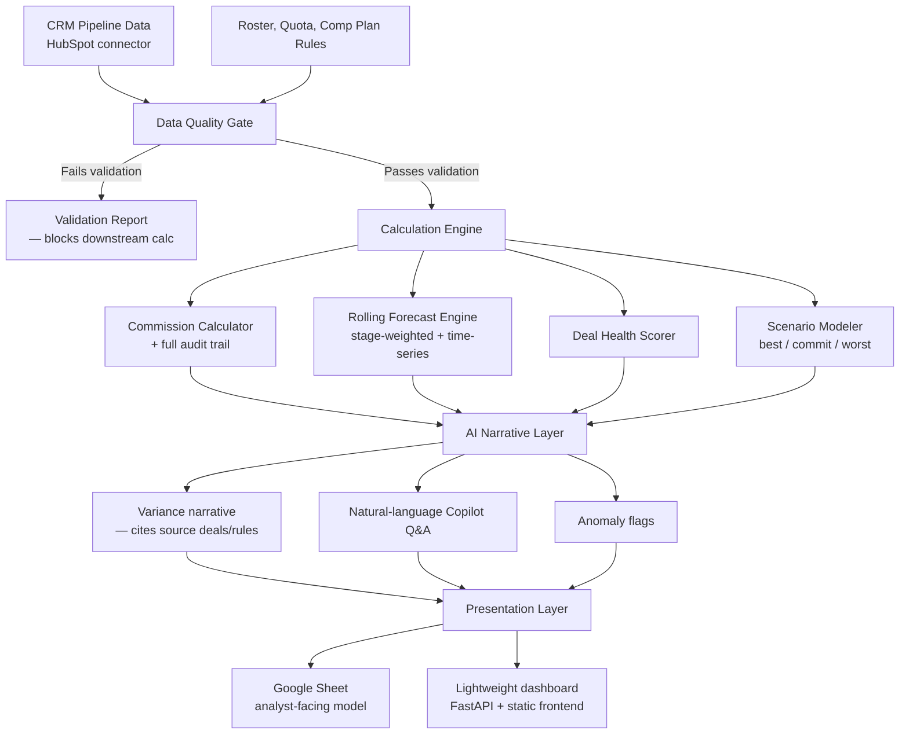

# Comp & Forecast Copilot

**A deterministic sales compensation and revenue forecasting engine with an explainable AI narrative layer.**

Built to answer one question the way a RevOps/Sales Planning team actually needs it answered: *"Why is this number what it is — and can I trust it?"*

---

## 1. Business Problem Statement

Sales organizations run two parallel, high-stakes calculations every month:

1. **What do we owe reps?** (commission, accelerators, clawbacks)
2. **What revenue are we actually going to close?** (pipeline-to-revenue forecast)

Both calculations routinely break down for the same underlying reason: **the math lives in spreadsheets that only one person understands, and by the time a number looks wrong, nobody can trace it back to the deal, rule, or assumption that produced it.**

The 2026 sales-compensation and RevOps tooling market (CaptivateIQ, Xactly, Visdum, Clari, Varicent) has converged on the same conclusion from a different direction: **explainability, not automation, is now the deciding factor.** The tools winning enterprise deals aren't the ones with the fanciest AI — they're the ones where every payout and every forecast number can be traced back to its source and defended in a room. Visdum, for example, is ranked first among AI comp platforms specifically because its AI can explain *why* a payout is what it is and trace a broken one to its cause — and explicitly **cannot change pay on its own.**

At the same time, the industry has an honest, well-documented failure mode: **AI forecasting amplifies bad data instead of fixing it.** Firms with clean, milestone-based pipelines see 85–95% forecast accuracy from AI-assisted models; firms with messy CRM data collapse to 50–60%, regardless of how good the model is. The prerequisite for AI ROI is a disciplined pipeline, not a smarter algorithm.

**This project exists to demonstrate both lessons in one small, fully legible system:**
- A **deterministic calculation core** for commissions and forecasting that is 100% auditable — no black boxes, no "the AI decided."
- A **data quality gate** that runs *before* any calculation, because a forecast built on bad data is worse than no forecast.
- An **AI layer that is strictly explanatory** — it writes the narrative, flags anomalies, and answers natural-language questions about the numbers, but it never touches the arithmetic or the payout decision.

The goal isn't to compete with CaptivateIQ or Clari. It's to build a small enough system that every design decision — the calculation logic, the AI boundary, the data validation rules — can be explained end-to-end in an interview, the way a RevOps hire is actually expected to reason about a comp plan or a forecast model.

---

## 2. Who This Is For (and What It Replaces)

| Problem today | What this project does instead |
|---|---|
| Commission math lives in a fragile spreadsheet only one person can debug | Deterministic calc engine with a full audit trail per payout |
| Forecasts are a static monthly snapshot, stale within a week | Continuous, rolling forecast recalculated from live pipeline data |
| "Why did the forecast move?" takes an analyst an afternoon to reverse-engineer | AI narrative layer generates the variance explanation on demand, citing the specific deals behind it |
| Stalled or at-risk deals go unnoticed until quarter-end | Deal-health scoring flags activity gaps and stage-duration thresholds automatically |
| Nobody questions the CRM data quality until the forecast is already wrong | A Data Quality Gate blocks calculation on dirty data and reports exactly what's wrong |

---

## 3. User Flow

**The core interaction loop, end to end:**
1. Pipeline and roster data sync in from HubSpot (or CSV import for demo purposes).
2. The Data Quality Gate runs first — always. If a deal is missing a close date, a rep has no quota assigned, or a deal has sat in a stage past its threshold, the gate reports it before anything downstream calculates.
3. The Calculation Engine runs deterministic logic: commissions resolved against plan rules, a rolling forecast blended from stage-weighting and historical win-rate, deal-health scores, and scenario models.
4. Every output from the calculation engine carries its own audit trail — the exact rule, deal, and rate that produced it.
5. The AI layer reads the calculation engine's *outputs and audit trails only* — never raw deal data it could hallucinate over — and produces plain-English variance narratives or answers ad hoc questions.
6. Results surface in a Google Sheet (for the analyst-credibility demo — PivotTables, XLOOKUP-driven lookups) and a thin dashboard (for the "click a button, get a board-ready narrative" demo moment).

---

## 4. Architecture

### Layer 0 — Data Quality Gate
The layer most tools skip, and the one that determines whether anything downstream is trustworthy.
- Missing/invalid close dates, orphaned deals, reps without quotas, deals stuck past a stage-duration threshold
- Runs before every calculation; nothing executes on unvalidated data
- Outputs a structured validation report, not just a pass/fail

### Layer 1 — Data Foundation
- CRM Pipeline (HubSpot sync)
- Roster & Quota (rep, team, quota, start date, ramp status)
- Comp Plan Rules (tiered rates, accelerators, clawback conditions — modeled as lookup tables, not hardcoded conditionals)
- Historical Actuals (for time-series calibration and win-rate baselines)

### Layer 2 — Calculation Engine (deterministic, Python)
- **Commission Calculator** — resolves every payout against plan rules with a full trace (deal → rule → rate → amount)
- **Rolling Forecast Engine** — stage-weighted probability blended with time-series trend; recalculated continuously, not as a static monthly snapshot
- **Deal Health Scorer** — flags stalled deals via activity-gap and stage-duration thresholds
- **Scenario Modeler** — best/commit/worst cases, and what-if modeling for quota or rate changes

### Layer 3 — AI Narrative & Copilot Layer (explanation-only, by design)
- Variance narratives ("why did forecast move") that cite the specific deals and rules behind the number
- Natural-language Q&A over the calculated outputs
- Anomaly commentary — flagged, never auto-corrected

**Hard boundary:** the AI layer never performs arithmetic and never has write access to payout or forecast values. It reads calculation-engine outputs and writes narrative only. This mirrors the explainability standard the 2026 comp-tech market has converged on — AI that explains and traces, but cannot change the number itself.

### Layer 4 — Presentation
- Google Sheet: the analyst-facing model, built with real formulas (PivotTables, XLOOKUP/INDEX-MATCH) — not a shell around an API call
- Lightweight dashboard (FastAPI + static HTML/CSS/JS, matching the stack of the companion CRM feedback-loop project) for the live-demo narrative-generation moment

---

## 5. Tech Stack

| Component | Choice |
|---|---|
| Calculation engine | Python |
| API layer | FastAPI |
| Persistence | SQLite (local) → Postgres (swap via env var) |
| Data foundation (analyst layer) | Google Sheets + Apps Script |
| AI narrative layer | Anthropic API (Claude) — explanation and Q&A only |
| CRM integration | HubSpot API |
| Frontend | Vanilla HTML/CSS/JS, no build step |

---

## 6. Key Design Decisions (worth defending in an interview)

- **The AI never does arithmetic.** All commission and forecast math happens in deterministic code with a full audit trail; AI is scoped to narrative generation and anomaly flagging only. This is the single most defensible design choice in the project and the one most current comp-tech vendors treat as their core differentiator.
- **Data validation happens before calculation, not after.** A forecast or payout built on bad data is worse than no forecast — the Data Quality Gate is a first-class feature, not error handling bolted on later.
- **Forecasting is continuous, not a static snapshot.** The system recalculates on demand rather than producing a monthly frozen number, reflecting the industry shift away from static annual/period forecasting.
- **Every calculated number is traceable to its source.** No output exists without a path back to the deal, rule, or rate that produced it.

---

## 7. Build Roadmap

- [x] Data Quality Gate — validation rules + structured report
- [x] Commission Calculator — plan-rule engine with audit trail
- [x] Rolling Forecast Engine — stage-weighted + time-series blend
- [x] Deal Health Scorer
- [x] Scenario Modeler
- [x] AI Narrative Layer — variance explanations + Copilot Q&A
- [ ] Google Sheet data foundation (PivotTables, XLOOKUP model) — export script done (scripts/export_to_sheets.py); PivotTables/XLOOKUP formulas are manual analyst work
- [x] Dashboard (FastAPI + static frontend)
- [ ] HubSpot pipeline sync (shared with the CRM feedback-loop project)

---

## 8. Relationship to Companion Projects

This project shares its data source (HubSpot pipeline) and its core AI-boundary principle (AI extracts/explains, never decides) with the companion **GTM CRM Feedback Loop** project — together they form one coherent pipeline: CRM → forecast/comp engine → board-ready narrative.
